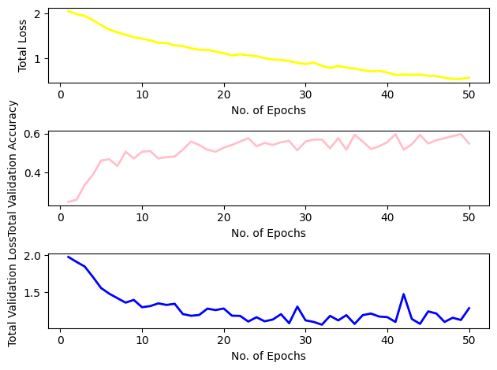
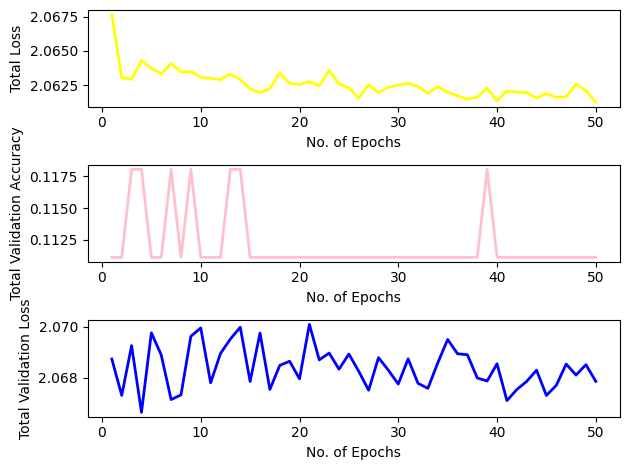

# Model Architecture :
CNN - Used 4 Convolutional layer each with a batch normalizer , One pooling layer , one adaptive pooling layer  for dimension correction , 2 dropout layers and 3 fully connected layer. I experimented with a lot of different combinations but this gave me a better overall accuracy. 
RNN - Used one embedding layer , one LSTM layer and one fully connected linear layer.
Didn't give much thought behind the architecture of RNN. Reason in comparison
Multimodel - wansn't able to complete it.

# Comparison of the models:
CNN performed way better than RNN. CNN was able to learn and predict emotions based on spectrogram to a much better extent than RNN 
CNN best accuracy : 59.77 %
RNN best accuracy : 11.11 %
This gap in accuracy is potentially due to non-expressive texts which the model was trained upon. The texts for different emotions were same, so they weren't able to provide a clear picture for the model to perform good.
The Multimodel according to me will lie somewhere between the CNN and RNN as it depends on both , however decreasing the weightage of RNN may give us a slightly better result (more closer to CNN)

Plots for CNN

Plots for RNN

